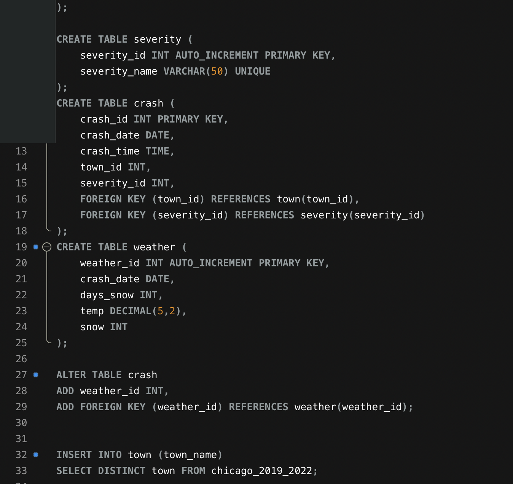
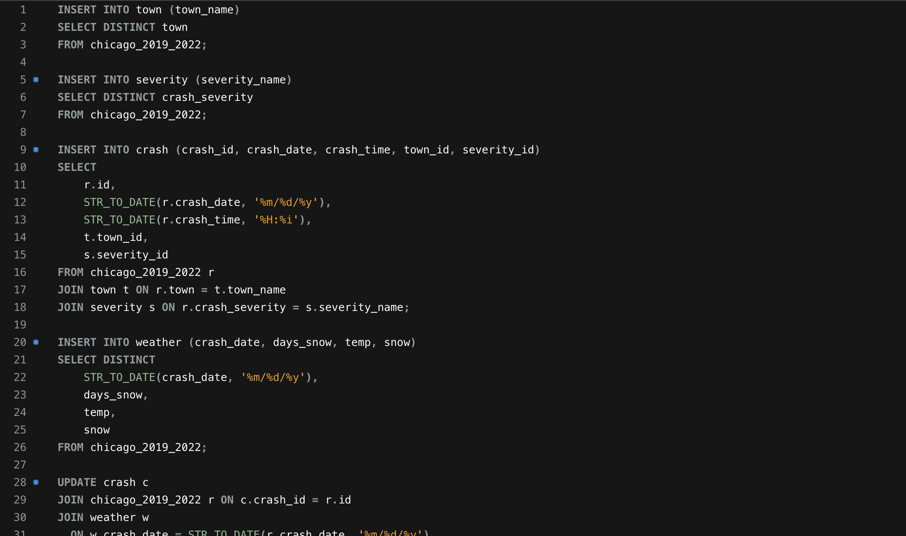

I took the dataset from my other page, and worked on it to bring it up to third normal form [here](https://artemis-fowl-2nd.github.io/blogs_quarto/posts/test/).

For this process, I created empty tables for the necessary sorting, and gave them columns with the appropriate data types for what they will hold. 

Then, I inserted unique combinations of the appropriate columns, and connected them together with IDs.

This makes the database much more efficient and standardized for storage and retrieval of data. It also makes it less convenient for my use, of extracting it for analysis. But this is more impressive. 